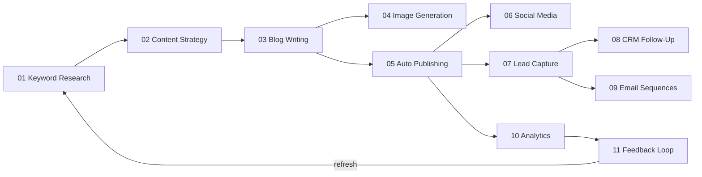

# SEO_LEAD — Complete Workflow Guide

> **11 automated workflows** that take your business from keyword research to analytics-driven optimization. Each workflow reads from & writes to a shared Google Sheet, with AI (GPT-4o) powering decisions throughout.

---

## Architecture Overview



### Shared Infrastructure

| Component | File | Purpose |
|-----------|------|---------|
| Config | `shared/config.py` | Loads all `.env` settings into a typed `Settings` dataclass |
| AI Client | `shared/ai_client.py` | `ask_ai()` and `ask_ai_json()` wrappers with retries, token tracking, dry-run mocks |
| Google Sheets | `shared/google_sheets.py` | `SheetsClient` class — read rows, append rows, update cells via gspread |
| Logger | `shared/logger.py` | Structured logging to console + `logs/seo_lead.log` |
| Notifier | `shared/notifier.py` | Email (SMTP) and Slack webhook notifications |
| HTTP Server | `server.py` | Flask app routing `POST /run/wf01` … `POST /run/wf11` to each workflow |

### Data Flow: Google Sheets Tabs

| Tab Name | Written By | Read By |
|----------|-----------|---------|
| `NicheInputs` | User (manual) | WF01 |
| `KeywordResearch` | WF01 | — |
| `ContentGaps` | WF01 | — |
| `ContentQueue` | WF01 → WF02 updates | WF02 |
| `ContentCalendar` | WF02 → WF03 updates | WF03 |
| `BlogOutlines` | WF02 | WF03 |
| `ClusterMap` | WF02 | — |
| `PublishQueue` | WF03 | WF04, WF05 |
| `ImageAssets` | WF04 | WF05 |
| `PublishedArticles` | WF05 | WF03 (links), WF06, WF10 |
| `SocialContent` | WF06 | — |
| `MasterLeadList` | WF07 | WF08, WF09, WF10 |
| `FollowUpLog` | WF08 | — |
| `EmailSequences` | WF09 | — |
| `WeeklyAnalytics` | WF10 | WF11 |
| `PerformanceReport` | WF10 | WF11 |
| `OptimizationActions` | WF11 | — |

---

## Workflow 01 — Keyword & Market Research

**Module:** `01_Keyword_Market_Research/`

**Purpose:** Discover and prioritize keyword opportunities for your niche.

### Pipeline Steps

| Step | Action | File |
|------|--------|------|
| 1 | Read niche + seed keywords from `NicheInputs` sheet (or CLI args) | `main.py` |
| 2 | Expand keywords via DataForSEO Search Volume API | `keyword_expander.py` |
| 3 | Get additional keyword suggestions from DataForSEO | `keyword_expander.py` |
| 4 | AI clusters all keywords by intent + scores them 1-10 | `ai_clustering.py` |
| 5 | Pull top 10 SERP results per primary keyword (DataForSEO) | `competitor_analysis.py` |
| 6 | AI analyzes SERP data for content gaps + weak competitors | `competitor_analysis.py` |
| 7 | Save keyword data → `KeywordResearch`, gaps → `ContentGaps` | `sheets_writer.py` |
| 8 | Push top N keywords → `ContentQueue` (status=`new`) | `sheets_writer.py` |
| 9 | Send notification summary | `main.py` |

### External APIs
- **DataForSEO** — Search volume, keyword suggestions, SERP results
- **OpenAI** — Keyword clustering, competitor gap analysis

### Key Config
- `MIN_KEYWORD_VOLUME` — Filter threshold (default: 100)
- `TOP_KEYWORDS_TO_QUEUE` — How many push to ContentQueue (default: 10)

---

## Workflow 02 — Content Strategy & Blog Planning

**Module:** `02_Content_Strategy_Blog_Planning/`

**Purpose:** Turn keyword opportunities into a structured content calendar with outlines.

### Pipeline Steps

| Step | Action | File |
|------|--------|------|
| 1 | Read keywords from `ContentQueue` where status=`new` | `main.py` |
| 2 | AI generates content strategy (types, titles, cluster map) | `content_planner.py` |
| 3 | AI generates detailed blog outlines for each article | `outline_generator.py` |
| 4 | Build publishing calendar (Mon/Wed/Fri, priority-sorted) | `calendar_builder.py` |
| 5 | Save calendar → `ContentCalendar`, outlines → `BlogOutlines` | `sheets_writer.py` |
| 6 | Save cluster map → `ClusterMap` | `sheets_writer.py` |
| 7 | Update `ContentQueue` status to `planned` | `sheets_writer.py` |
| 8 | Send notification | `main.py` |

### AI Decisions
- Content type per keyword (blog post, ultimate guide, listicle, comparison, etc.)
- Word count target based on competition level
- Priority ranking and pillar/cluster classification
- Outline structure with H2/H3 hierarchy, CTA placements, FAQ sections

---

## Workflow 03 — AI Blog Writing & SEO Optimization

**Module:** `03_AI_Blog_Writing_SEO/`

**Purpose:** Write full-length, SEO-optimized HTML articles from outlines.

### Pipeline Steps

| Step | Action | File |
|------|--------|------|
| 1 | Read planned articles from `ContentCalendar` (status=`planned`) | `main.py` |
| 2 | Fetch matching outline from `BlogOutlines` sheet | `main.py` |
| 3 | AI writes full HTML article from outline | `article_writer.py` |
| 4 | AI generates SEO metadata (meta title, description, schema, OG tags) | `seo_optimizer.py` |
| 5 | AI runs 12-factor SEO quality audit | `seo_optimizer.py` |
| 6 | If score < 70, rewrite with audit feedback (max 1 retry) | `main.py` |
| 7 | Resolve `[INTERNAL_LINK]` placeholders into real `<a>` tags | `link_resolver.py` |
| 8 | Save article HTML to local file | `main.py` |
| 9 | Update `ContentCalendar` status → `written`, add SEO score | `sheets_writer.py` |
| 10 | Queue to `PublishQueue` (status=`ready`) | `sheets_writer.py` |
| 11 | Send notification | `main.py` |

### SEO Audit Factors (12)
Keyword in H1, keyword in first 100 words, keyword density (1-2%), H2/H3 structure, internal links, image placeholders, FAQ section, CTA placements, meta title length, meta description length, readability, word count.

---

## Workflow 04 — Featured Image & Visual Generation

**Module:** `04_Featured_Image_Visual_Gen/`

**Purpose:** Generate AI images (DALL-E 3) for each article.

### Pipeline Steps

| Step | Action | File |
|------|--------|------|
| 1 | Read articles from `PublishQueue` (status=`ready`) | `main.py` |
| 2 | AI generates optimized DALL-E prompts (featured, social, Pinterest) | `image_prompt_generator.py` |
| 3 | Call DALL-E 3 API to generate images | `image_creator.py` |
| 4 | Download images to local `output/` directory | `image_creator.py` |
| 5 | Record image URLs in `ImageAssets` sheet | `main.py` |
| 6 | Send notification | `main.py` |

### Image Types Generated
- **Featured Image** (1792×1024) — Blog hero
- **Social Thumbnail** (1024×1024) — Instagram/LinkedIn
- **Pinterest Pin** (1024×1792) — Vertical format

---

## Workflow 05 — Auto Publishing System

**Module:** `05_Auto_Publishing_System/`

**Purpose:** Validate, format, and publish articles to WordPress.

### Pipeline Steps

| Step | Action | File |
|------|--------|------|
| 1 | Read articles from `PublishQueue` (status=`ready`) | `main.py` |
| 2 | Validate completeness (title, slug, meta title, meta description) | `publisher.py` |
| 3 | Load article HTML from local file | `main.py` |
| 4 | Format for WordPress REST API (Yoast SEO meta fields) | `publisher.py` |
| 5 | Publish to WordPress via REST API | `publisher.py` |
| 6 | Submit URL to Google Indexing API for fast crawling | `publisher.py` |
| 7 | Record in `PublishedArticles` sheet | `main.py` |
| 8 | Update `PublishQueue` status → `published` | `main.py` |
| 9 | Send notification | `main.py` |

---

## Workflow 06 — Social Media Repurposing

**Module:** `06_Social_Media_Repurposing/`

**Purpose:** Repurpose published articles into platform-specific social posts.

### Pipeline Steps

| Step | Action | File |
|------|--------|------|
| 1 | Read recently published articles from `PublishedArticles` | `main.py` |
| 2 | Filter to articles not yet repurposed (no SocialStatus) | `main.py` |
| 3 | AI generates posts for 5 platforms | `social_generator.py` |
| 4 | Save all social content to `SocialContent` sheet | `main.py` |
| 5 | Mark articles as repurposed | `main.py` |
| 6 | Send notification | `main.py` |

### Platforms
- **Twitter/X** — 5-7 tweet thread
- **LinkedIn** — 1200-1500 char professional post
- **Instagram** — Caption + 15-20 hashtags
- **Facebook** — 300-500 char conversational post
- **Pinterest** — 200-300 char SEO pin description

---

## Workflow 07 — Lead Capture Funnel

**Module:** `07_Lead_Capture_Funnel/`

**Purpose:** Process, validate, enrich, and score incoming leads.

### Pipeline Steps

| Step | Action | File |
|------|--------|------|
| 1 | Read new leads from `NewLeads` sheet | `main.py` |
| 2 | Validate lead data (email format, disposable domain check) | `lead_scorer.py` |
| 3 | AI enriches and scores each lead (1-100) | `lead_scorer.py` |
| 4 | Classify tier: HOT (80-100), WARM (50-79), COOL (20-49), LOW (0-19) | `lead_scorer.py` |
| 5 | Add scored leads to `MasterLeadList` | `main.py` |
| 6 | Send notification (especially for HOT leads) | `main.py` |

### AI Scoring Criteria
Business email (+20), company size (+15), high-intent source page (+25), downloaded lead magnet (+10), industry match (+15), has phone (+5).

---

## Workflow 08 — CRM & AI Follow-Up

**Module:** `08_CRM_AI_FollowUp/`

**Purpose:** Generate personalized follow-up email sequences based on lead tier.

### Pipeline Steps

| Step | Action | File |
|------|--------|------|
| 1 | Read leads from `MasterLeadList` needing follow-up | `main.py` |
| 2 | Determine follow-up cadence based on tier | `followup_engine.py` |
| 3 | AI generates personalized emails for each cadence step | `followup_engine.py` |
| 4 | Log all generated emails to `FollowUpLog` sheet | `main.py` |
| 5 | Send notification | `main.py` |

### Follow-Up Cadences
- **HOT:** Day 0, 1, 3, 7
- **WARM:** Day 1, 3, 7, 14
- **COOL:** Day 3, 7, 14, 30

---

## Workflow 09 — Email Marketing Sequences

**Module:** `09_Email_Marketing_Sequences/`

**Purpose:** Generate nurture email sequences and weekly newsletters.

### Pipeline Steps

| Step | Action | File |
|------|--------|------|
| 1 | Read subscribers/segments from sheets | `main.py` |
| 2 | Determine which nurture emails are due | `main.py` |
| 3 | AI generates each nurture email (welcome, educational, case study, etc.) | `email_generator.py` |
| 4 | AI generates weekly newsletter from recent articles | `email_generator.py` |
| 5 | Save all content to `EmailSequences` sheet | `main.py` |
| 6 | Send notification | `main.py` |

### 6-Email Nurture Sequence
1. **Day 0** — Welcome + deliver lead magnet
2. **Day 3** — Educational content
3. **Day 7** — Case study / social proof
4. **Day 10** — Common mistakes to avoid
5. **Day 14** — Free tool / template
6. **Day 21** — Soft pitch + CTA

---

## Workflow 10 — Analytics & Conversion Tracking

**Module:** `10_Analytics_Conversion_Tracking/`

**Purpose:** Pull performance data from multiple sources and generate reports.

### Pipeline Steps

| Step | Action | File |
|------|--------|------|
| 1 | Pull traffic data from Google Analytics 4 | `data_collector.py` |
| 2 | Pull keyword rankings from Google Search Console | `data_collector.py` |
| 3 | Pull lead conversion metrics from `MasterLeadList` | `data_collector.py` |
| 4 | Pull email campaign performance | `data_collector.py` |
| 5 | Save raw metrics to `WeeklyAnalytics` sheet | `main.py` |
| 6 | AI generates weekly performance report | `report_generator.py` |
| 7 | Save report to `PerformanceReport` sheet | `main.py` |
| 8 | Email formatted report to team | `main.py` |

### Report Sections
Traffic summary, top pages, SEO ranking movers, lead generation, email performance, anomalies (>20% changes), 3-5 specific AI recommendations.

---

## Workflow 11 — Performance Feedback Loop

**Module:** `11_Performance_Feedback_Loop/`

**Purpose:** Use analytics to optimize future content — closes the loop back to WF01.

### Pipeline Steps

| Step | Action | File |
|------|--------|------|
| 1 | Read performance data from `WeeklyAnalytics` and `PerformanceReport` | `main.py` |
| 2 | AI analyzes top performers → patterns to replicate | `optimizer.py` |
| 3 | AI identifies underperformers → specific fixes | `optimizer.py` |
| 4 | AI finds "almost-there" pages (positions 8-20) → push actions | `optimizer.py` |
| 5 | AI flags content refresh candidates (>20% decline) | `optimizer.py` |
| 6 | AI suggests keyword adjustments (new targets, deprioritize, long-tail) | `optimizer.py` |
| 7 | Save optimization actions to `OptimizationActions` sheet | `main.py` |
| 8 | Queue content refresh briefs back to `ContentQueue` | `main.py` |
| 9 | Send notification | `main.py` |

### Optimization Outputs
- **Replicate actions** — What's working, do more of it
- **Underperformer fixes** — Specific URL-level fix plans
- **Almost-there pushes** — Pages at positions 8-20 that could reach page 1
- **Content refresh briefs** — Queued back to WF03 for rewriting
- **Keyword adjustments** — Fed back to WF01 for new research cycles

---

## Running the System

### Dry-Run Mode (Testing)
Set `DRY_RUN=true` in `.env` — all API calls are skipped, realistic mock data is used instead. Perfect for testing the full pipeline without costs.

### CLI Execution
```bash
# Run a single workflow
python -m 01_Keyword_Market_Research.main
python -m 02_Content_Strategy_Blog_Planning.main
# ... etc

# Or with custom niche
python -m 01_Keyword_Market_Research.main --niche "email marketing" --seeds "email automation" "newsletter tools"
```

### HTTP Server (Cloud Run)
```bash
python server.py                    # Local: http://localhost:8080
curl -X POST http://localhost:8080/run/wf01   # Trigger WF01
curl -X POST http://localhost:8080/run/wf02   # Trigger WF02
```

### Required API Keys
| Service | Config Key | Used By |
|---------|-----------|---------|
| OpenAI (GPT-4o + DALL-E 3) | `OPENAI_API_KEY` | All workflows |
| DataForSEO | `DATAFORSEO_LOGIN` / `DATAFORSEO_PASSWORD` | WF01 |
| Google Sheets | `GOOGLE_SERVICE_ACCOUNT_JSON` / `GOOGLE_SHEET_ID` | All workflows |
| WordPress | `WORDPRESS_URL` / `WORDPRESS_TOKEN` | WF05 |
| SMTP / Slack | `SMTP_*` or `SLACK_WEBHOOK_URL` | Notifications |
